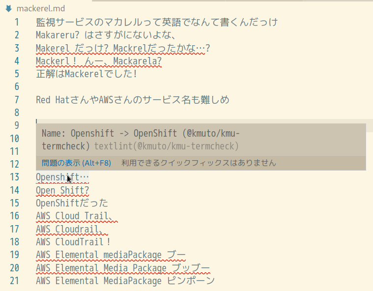

# @kmuto/textlint-rule-kmu-termcheck

英語アルファベットで記述されている製品名やサービス名などの表記ミスをチェックするためのtextlintルールです。



## インストール

[npm](https://www.npmjs.com/)でインストールできます。

```
npm install @kmuto/textlint-rule-kmu-termcheck
```

## 使い方

`.textlintrc.json`に記述する方法：

```json
{
    "rules": {
        "@kmuto/kmu-termcheck": true
    }
}
```

CLIで直接指定する方法：

```
textlint --rule @kmuto/kmu-termcheck README.md
```

### オプション

挙動を調整するオプションを用意しています。

- `allows: ["word1", "word2", ...]`: エラー対象から無視したい語句を指定します。スペースを含む語句も指定できます。
- `userDic: ["file1", "file2", ...]`: 追加の辞書ファイルを指定します。辞書ファイルは各語句を改行で区切っただけのシンプルなテキストファイルです。辞書ファイルにおいて`#`から始まる行は無視されます。現状の形態素解析および類似度検査の制約で、辞書の語句として英語アルファベット（a〜z、A〜Z）とスペースのみに記述文字は限定されます。
- `commonDic: true|false`: 一般技術辞書の有効/無効設定です（デフォルトはtrue）。
- `hatenaDic: true|false`: はてな社のごく一部の技術についての辞書の有効/無効設定です（デフォルトはtrue）。
- `awsDic: true|false`: Amazon Web Servicesの技術についての辞書の有効/無効設定です（デフォルトはtrue）。
- `googlecloudDic: true|false`: Google Cloudの技術についての辞書の有効/無効設定です（デフォルトはtrue）。
- `compoundMode: true|false`: 文中でスペースで区切られた語句を、1つのかたまりの語句として扱うモードにする有効/無効設定です（デフォルトはtrue）。
- `ignoreFirstCapital: true|false`: 語句の先頭の大文字/小文字の差異を無視するモードの有効/無効設定です（デフォルトはtrue）。

検査対象によっては、偽陽性が大量に出る可能性があります。個々の用途に応じて辞書のオン・オフ、およびカスタム辞書の利用を検討してください。

また、`error`にするのが強すぎると思われる場合は、severityを変更して読み込むとよいでしょう。

設定例：
```json
{
    "rules": {
        "@kmuto/kmu-termcheck": {
            allows: ["mattena"],
            userDic: ["strong-dictionary.txt"],
            commonDic: true,
            hatenaDic: true,
            awsDic: true,
            googleDic: true,
            compoundMode: true,
            ignoreFirstCapital: true,
            severity: "warning"
        }
    }
}
```

## 仕組みと制約

- 形態素解析には[kuromoji.js](https://github.com/takuyaa/kuromoji.js)（実際にはそのラッパーの[kuromojin.js](https://github.com/azu/kuromojin)）を利用しています。その性質上、数字やハイフンなどが含まれるとそこで区切られてしまい、検査対象にすることができません。区切られてしまう語句には、prhなどを利用することをお勧めします。
- 類似度検査には[didYouMean.js](https://github.com/dcporter/didyoumean.js)を利用しています。リーベンシュタイン距離を使ったシンプルなもので、日本語の検査には利用できません。ほかにもいくつかdidyoumean実装はあるようです。
- 現状では`fs`モジュールでシンプルに辞書を読み込んでいるため、Webブラウザ上での動作はできません。
- fixerのほうは現状では予定はありません。偽陽性がおそらく多いので、かえって有害になりそうです。

## 協力者の方々

TBD

要望はあまり応えられない可能性があります。リファクタリングや辞書強化など、PR歓迎です。

- [Issue](https://github.com/kmuto/textlint-rule-kmu-termcheck/issues)
- [PR](https://github.com/kmuto/textlint-rule-kmu-termcheck/pulls)

## ライセンス

```
MIT License

Copyright (c) 2023 Kenshi Muto

Permission is hereby granted, free of charge, to any person obtaining a copy
of this software and associated documentation files (the "Software"), to deal
in the Software without restriction, including without limitation the rights
to use, copy, modify, merge, publish, distribute, sublicense, and/or sell
copies of the Software, and to permit persons to whom the Software is
furnished to do so, subject to the following conditions:

The above copyright notice and this permission notice shall be included in all
copies or substantial portions of the Software.

THE SOFTWARE IS PROVIDED "AS IS", WITHOUT WARRANTY OF ANY KIND, EXPRESS OR
IMPLIED, INCLUDING BUT NOT LIMITED TO THE WARRANTIES OF MERCHANTABILITY,
FITNESS FOR A PARTICULAR PURPOSE AND NONINFRINGEMENT. IN NO EVENT SHALL THE
AUTHORS OR COPYRIGHT HOLDERS BE LIABLE FOR ANY CLAIM, DAMAGES OR OTHER
LIABILITY, WHETHER IN AN ACTION OF CONTRACT, TORT OR OTHERWISE, ARISING FROM,
OUT OF OR IN CONNECTION WITH THE SOFTWARE OR THE USE OR OTHER DEALINGS IN THE
SOFTWARE.
```
